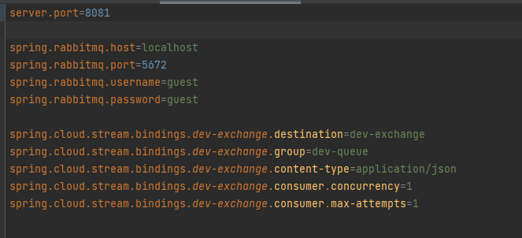
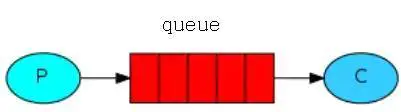
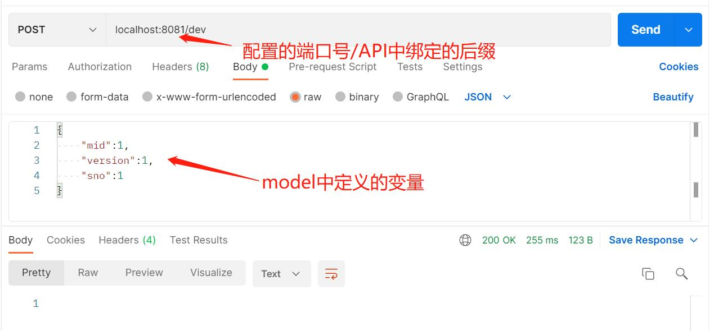
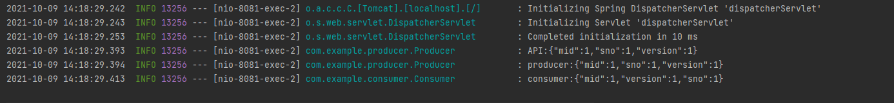

# 基础版RabbitMQ集成SpringCloud Stream
此模块演示了一个简单的包含接口的SpringCloud Stream集成RabbitMQ的应用

## 1. 配置RabbitMQ地址以及服务地址

<a href="src/main/resources/application.properties" target="_blank">配置文件</a>

## 2. 定义常量与模型
在这个基础的演示中我们仅仅定义一个管道名为常量即可，然后自定义一个消息发送模型用来传递消息，详见: [常量](src/main/java/com/example/constance)     

## 3. 生产者与消费者
定义一个完整的消费者与生产者模型，流程为: 生产者在一定条件下产生数据，发送到消息队列中，消费者监听队列获取对应的信息，消费者读取信息并做出对应的操作

其中消费者与之前的[ListenerStream](../ListenerStream)类似，读取并在控制台打印读取到的信息: [Consumer](src/main/java/com/example/consumer/Consumer.java)      

生产者如果想要向消息队列中发送消息，需要先声明一个方法: [RabbitStreamAPI](src/main/java/com/example/rabbitstream/RabbitStreamAPI.java)将生产者与消息队列绑定，后续通过调用这里的端口来实现向消息队列发送消息     

然后生产者负责产生消息，并发送到消息队列中，在这里[Producer](src/main/java/com/example/producer/Producer.java)仅仅通过调用RabbitStreamAPI中声明的生产者来向消息队列发送消息

## 4. 集成与实现
在这里，将生产者调用包到一个[Controller](src/main/java/com/example/controller/APIController.java)中，通过postman发送消息调用接口来实现整个流程的调用，结果如下图所示

<a href="src/main/resources/application.properties" target="_blank">postman调用</a>

<a href="src/main/resources/application.properties" target="_blank">终端日志</a>
