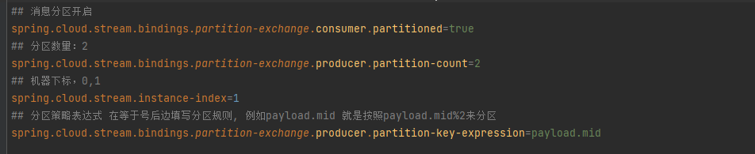
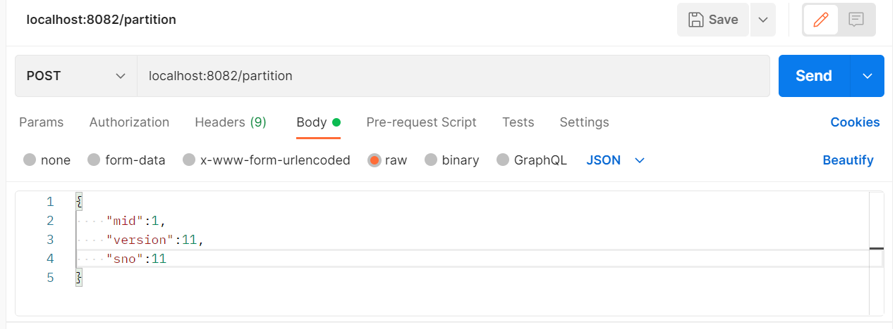
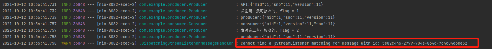

# 消息分区与条件消费
当消息过多的时候可能会出现需要多个消息队列来均衡负载的情况，在这个情况下，需要保证每一个消息都能被对应的消费者接收到，此时就需要考虑消息分区与条件消费

## 消息分区
需要添加的并不多，整体采用与Basic_RabbitMQ中相同的结构，仅需要在application.properties中添加：

<a href="src/main/resources/application.properties" target="_blank">配置文件</a>

然后在不同组件中将原有的dev-exchange变成对应的partition即可，然后在生产者发送消息的时候会自动判断进入哪个队列

## 条件消费
为了保证消息被对应的消费者接受，可以在消费者处添加监听条件,例如这次在[Consumer](src/main/java/com/example/consumer/Consumer.java)中添加了condition = "headers['flag'] == '1'"的条件，只消费header中flag等于1的消息。    

同时让[生产者](src/main/java/com/example/producer/Producer.java)对于同一消息一次发送两个flag分别为1和2的的消息,    

发送消息

得到的结果为能接到flag为1的但是无法接收到flag为2的消息

消息接收
